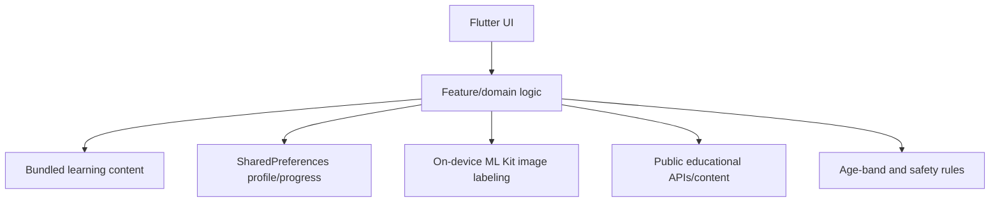

# Euphoriks Quizzie architecture

## Current release: local-first Flutter app

Quizzie keeps profile/progress state on-device and does not require an Euphoriks backend or child account.

### Layers

- **Presentation:** Material 3 widgets, navigation, short child-friendly interactions and accessible motion/colour choices.
- **Domain:** quiz scoring, missions, learning-topic selection, game completion and broad age-band filtering.
- **Local data:** Flutter Shared Preferences for explorer profile, progress, energy, question history and cached content metadata/data used by current services.
- **Public content:** Wikipedia/NASA/public GitHub-hosted educational content where implemented, with built-in fallback material for core experiences.
- **Image discovery:** camera/gallery image selection plus Google ML Kit labeling on-device; detected label text can be used for a public educational lookup.
- **Safety:** fictional aliases, broad age bands, no public/free-form child chat, no ads/analytics in the current release.

## Current data boundaries

Allowed child-facing profile state:

- fictional/generated explorer alias
- fictional avatar ID
- broad age band
- achievement/progress state
- curiosity energy
- completed topic/game IDs
- question history used to reduce repetition

Not requested as identity data in the current product:

- real name
- date of birth / exact age
- school
- phone or email
- exact location
- public profile or searchable handle
- unrestricted/public chat

## Network boundary

Quizzie is local-first, not network-free. Some experiences request public educational material from third parties. These requests can expose ordinary network metadata such as IP address and request headers to those third-party services. The privacy policy is the source of truth for release-specific network behaviour.

## Release identity boundary

The public product name is **Euphoriks Quizzie**, but the existing Dart package/repository slug and Android package/application identity retain the historical `curioverse` naming for Google Play update continuity. Rebranding must not silently create a new Android application identity.

## Evolution

A backend should be considered only when a real need such as cross-device sync or real friend collaboration exists. That decision requires threat modelling, parental-consent design where applicable, child-data retention rules, moderation, encryption, regional compliance review, data deletion/export flows, and updated Play declarations before release.
